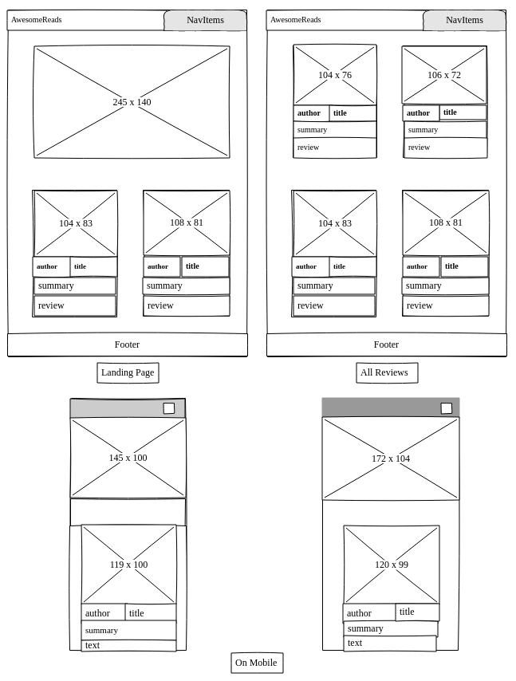
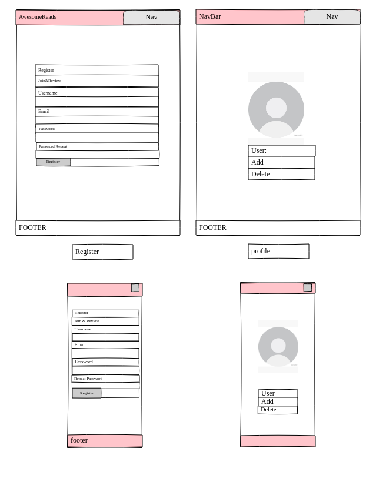
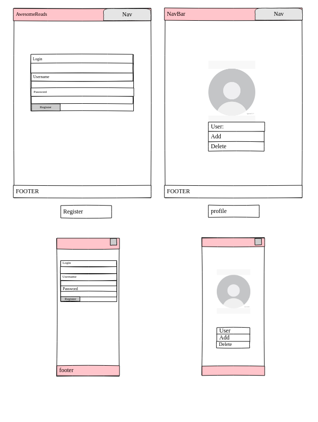
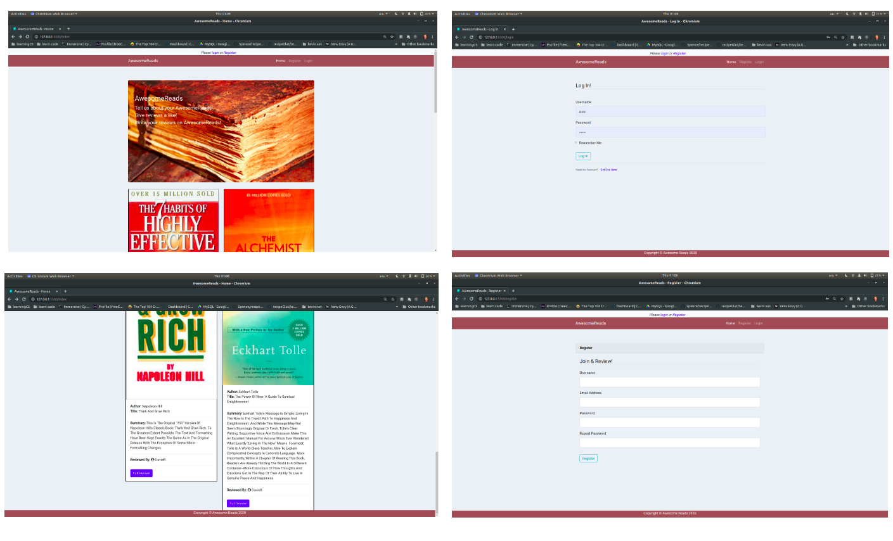
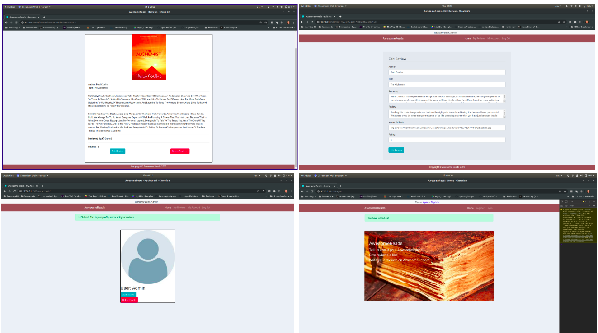

# *Awesome-Reads* 

This book review project is aimed at anyone who enjoys reading and talking about what they have read. Viewing & reviewing books, saving them in a library/list for future use,
finding new books and Authors, reading other peoples reviews, reading qoutes from books they are interested in. I'm an avid reader and was pretty motivated 

## *UX*

The Website is fully responsive and is designed to be easy to navigate with little distraction. The items in the navbar change if the user is logged in, limiting the content to an annonymous user. Logged in users are able to Create, update (edit) and delete their own reviews. A user can also log out. A user can feel, relatively, at ease with a secure account. Mongo DB holds users information and reviews. The user is able to register and login and view other reviews.

Each review on the home page can be clicked onto and that will load the single review page which shows the entire entry. If the user created the review on their page they will be able to edit and delete the review, and also delete their profile when they need to.

The add review allows the logged in user to create a review and enter it onto the database.>

## *Project Goals*

**User Goals**

1. To view other users review
2. To create an account on the site
3. To add a review of their own and edit any existing ones they have
4. To remove their reviews and account if they wish
5. To be able to add an image alongside their review

The overall goal of the project was to allow users to review books and create/upload/update their own book reviews viewable.
As an avid reader I liked the idea of a social book hang out. Like club. But thats beyond the scope of this project for now.
The idea was and stll is a place for good books with a summary and reviews by others.

The wireframes can be found in the Docs folder in Static, I didnt chance loading them out here because they may be oversized.
The project, like always, changed along the way but still turned out more or less like the idea in mind.

 **User Stories**

> As a user I want to be able to create a review 
>
> As a user I want to be able to view other peoples reviews
>
> As a user I want to be able to keep my reviews for future reference
>
> As a user I want to be able to save the books I wanted to read in the future.
>
> As a user I want to be able to like books that I'm interest in.
>
> As a user I want to be able to make a list of books I've already read.
>
> As a user I want to be able to make a profile.
>
> As a user I want to save my reviews to my profile.
>
> As a user I want to be able to delete my review
>
> As a user I want to be able to edit my review
>
> As a user I want to be able to delete my profile

**Wireframes**

### Future Implementations

As stressful as these 2 weeks have been and how rushed the finished app is, as I type this I still really enjoyed the process. In the future version of this app it will be a 'Book Chat' app, that was the original plan along with GoodReads and sockets.. where users can continue uploading books and reviewing others collections, but also with instant chat using socket.io, and absolutely with an API such as GoodReads or the OpenLibrary to add more zest to the conversation and discovery.

The user profile I would have liked to have spent more time on, It was fun making it basic. I still feel like this app is very incomplete and maybebuggy so I do definitely do see it as pet project upon finishing the course with CI.

## *Features*

1. Register and Login - Flask_session
2. Users came create unique usernames and log in/ out
3. Profile dedicated to the user with their own reviews
4. Image upload
5. More error handling and @login_required to make profiles and data more secure
6. Easy colors, easy on the eyes
7. Create, Read, Update, Delete functionality
8. Ability to upload a URL image for the review

## *DataBase*

MongoDB Atlas is used as my database backend for storing user and review details. There are 2 colllections, 'users' and 'reviews', 'user' holds the session details - username and password, 'reviews' holds the full book review details. As MongoDB is a non relational db model I both collections share the username an unique identifier that ties records in both collections together.

User Collection

{
"_id":"",
"username":"",
"password":""
}

Reviews Collection

{
"_id":"",
"author":"",
"title":" ",
"summary":".",
"review":""
"image":"",
"rating":"",
"username":""
}

## *Technolgoies Used*

This project utilizes Python, Flask, MongoDB, HTML, CSS and JavaScript technologies.

- The project uses Python 3 to create the app, create the routes, create the functions within those routes and handles all back end interactions.

- The project uses Flask framework to create and populate the templates.

- MongoDB Atlas The project uses MongoDB Atlas as a backend database.

- Bootstrap 4 The project uses Bootstrap to simplify the structure of the website and make the website responsive easily.

- HTML 5 and CSS3 The project uses HTML5 and CSS3 for website structure and design.

- Google Fonts The project used the Google 'Roboto' font across the site

- GitHub This project uses GitHub to remotely store the source code in a repository. The project can be cloned or downloaded from here. See Deployment section

- I used VSCode on my machine to build the project 

- My Linux terminal, this time I only used the terminal to manage my project tree.

- Pencil for the wireframes

Others to mention

- Flask Sessions for simplicity in creating a profile
- werkzeug.security to encrypt the user passwords
- MONGODB GUI
- Virtualenv
- StackOverflow - to get insight into different things within the project build
- DevTools - especially the responsive clicker.
- & ATOM; I also use Atom from time to time and used it to help debug my system

## *Testing* 

Most of my testing was in the debugger within Chrome, from time to time I used the breakpoints in the DevTools

This was just a quick list I made while building, if anything came up I'd pop it in.

First test after setting up I didnt connect to MONGO - square brackets instead of round on MONGO_URI

I used dummy data posts to check functionality.

Registration form wasn't rendering to the page - it was the way my route was set.

During development of my first MS3 I encountered quite a few errors, more than I can count actually. Mainly with globally installed files packages that were effecting my project workspace. I ended up having to restart the project 3 times over the last 2 weeks. The issue was down to me messing with other packages in a different workspace and not being aware of installing python packages globally and the effects it can have on the system. - I ended up wasting alot of time instead of just switching to gitpod and not practicing what I already kind of knew about Virtualenvs. And this is why my final project is now late for submission and just overrall rushed.

I swapped over to ATOM on my machine numerous times to try debug everything but still had the same issues.

Some modules not found because of venv.

The login page is tested throughout my tests as a number of my test operations require a logged in user.

All the error messages are working fine.

The registration page and logic are tested. I tested for mismatched passwords, duplicate user names, as well as successful registration.

The index page and reviews page is tested so that they load correctly. Some of my routes, reviews/ and my_account seem abit glitchy, sometimes they are speedy loading and other times they throw 404 errors.

@screen size 320px the jumbotron gets a little funky, but I guess thats the average screen size, not below.

Instead of editing a review and then it updating the database its creating a new record. Other than that everything is functioning well. The footer also is covering the end content atm will fix it once I get Heroku up and running.

## **Deployment**

I personally used vscode on my local machine to develop the site using Python 3.7.3 and deployed to Heroku via Github.

1. To download or clone the site to your local machine you will need to go to my repo see steps in https://help.github.com/en/articles/cloning-a-repository .
2. Before you download or clone the site you will need to ensure you have Python 3.7 installed.
3. Once you have Python installed, created a virtual environment as appropriate to you chosen IDE and os.
4. Run the requirements.txt file as appropriate to your IDE to install the relevant required packages dependencies for the project into your virtual environment.
5. Run the app.py file as appropriate to your chosen environment and os.
6. You should now be able to view the site on your localhost on port 5000.

## **Media & Resources**

Goodreads was what I was aiming for, maybe someday :) I really enjoy their site and app.

Flask Documentation

Wtforms Documentation

This was Inspiring
https://blog.miguelgrinberg.com/post/the-flask-mega-tutorial-part-ii-templates

His code is so well done it was good inspiration
http://book-bites.herokuapp.com/

Google images for the Jumbotron Image, I'm pretty sure it was pexel bay.

Corey Schafer for the walkthrough on forms
https://www.youtube.com/watch?v=MwZwr5Tvyxo&list=PL-osiE80TeTs4UjLw5MM6OjgkjFeUxCYH

Always dipping in and out of this site
https://www.fullstackpython.com/flask.html

There was some virtualenv tutorials I used from here
https://realpython.com/

StackOverflow of course

## **Acknowledgements**

Kevin and Xavier for always lending some time & advice

My Mentor

Ali Magee, my hats off to him

Migue Grinberg - I even bought the MiniBlog course after discovering his work, after buying his book, Flask - Python for WebDevelopment

Corey Schaffer for his walkthroughs on Wtf-Forms and a better understanding of Flask

Reddit - for the humour that was needed during these 2 weeks.

Spotify

## **Future Notes**

Make a plan and stick to it. Dont get distracted by packages and articles.